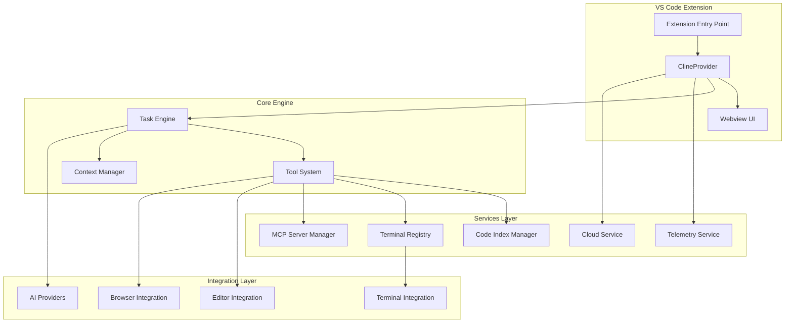
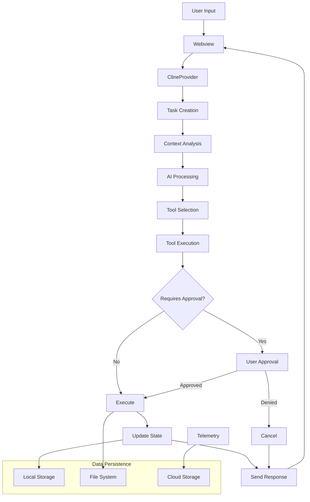
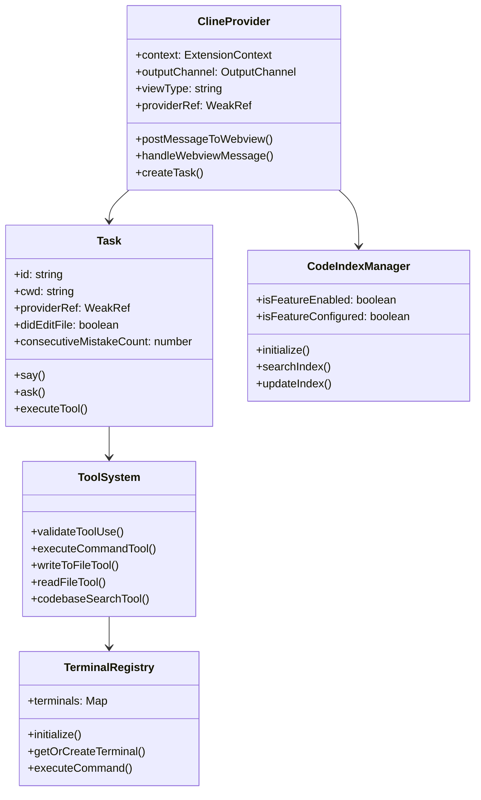

# Análise Executiva e de Negócios da Aplicação - Roo Code

**Resumo do documento:**

Esse documento é o resultado da análise do código-fonte do sistema Roo Code e engloba os seguintes pontos:

- **Visão de Nível Executivo:** Resumo do propósito da aplicação, como funciona em alto nível, regras de negócio principais e benefícios chave.
- **Visão de Nível Técnico:** Detalhamento da arquitetura do sistema, tecnologias utilizadas, fluxos principais, componentes-chave e diagramas (componentes, fluxo de dados, classes e implantação).
- **Visão de Produto:** Descrição detalhada do que o sistema faz, para quem é destinado, quais problemas resolve, casos de uso principais, funcionalidades e domínios de negócio.
- **Limitações da Análise:** Identificação das principais limitações encontradas durante a análise e sugestões para superá-las.

A análise foi baseada nos arquivos de código disponíveis.

---

## 1. Visão de Nível Executivo: Resumo Executivo

### Propósito da Aplicação

**Roo Code** (anteriormente chamado Roo Cline) é um assistente de IA autônomo para programação que funciona como uma extensão do Visual Studio Code. O sistema tem como objetivo principal revolucionar a experiência de desenvolvimento de software, fornecendo um parceiro de programação inteligente que pode executar tarefas complexas de forma autônoma.

O sistema se propõe a resolver o problema da baixa produtividade no desenvolvimento de software, automatizando tarefas repetitivas, auxiliando na geração de código, depuração, refatoração e documentação, permitindo que desenvolvedores foquem em problemas de maior valor agregado.

### Como Funciona (Alto Nível)

O Roo Code opera como uma extensão integrada ao VS Code que:

1. **Recebe comandos em linguagem natural** do desenvolvedor através de uma interface de chat
2. **Analisa o contexto do projeto** utilizando indexação de código e análise semântica
3. **Planeja e executa ações** utilizando um conjunto robusto de ferramentas (tools)
4. **Interage com modelos de IA** (OpenAI, Anthropic Claude, modelos locais, etc.) para gerar soluções
5. **Executa operações** como leitura/escrita de arquivos, execução de comandos no terminal, controle de navegador
6. **Fornece feedback visual** através de interface webview integrada ao VS Code

### Regras de Negócio de Alto Nível

- **Controle de permissões**: Todas as operações críticas (escrita de arquivos, execução de comandos) requerem aprovação do usuário
- **Proteção de arquivos**: Sistema `.rooignore` para proteger arquivos sensíveis de modificações
- **Modos especializados**: Diferentes personas (Code, Architect, Ask, Debug) com comportamentos específicos
- **Gestão de contexto**: Limitação inteligente de tokens para otimizar custos de APIs
- **Rastreamento de qualidade**: Sistema de métricas para detectar e corrigir erros consecutivos
- **Telemetria**: Coleta de dados de uso para melhoria contínua (PostHog)

### Benefícios Chave

- **Aumento da produtividade**: Automação de tarefas repetitivas e geração rápida de código
- **Redução de erros**: Assistência na depuração e refatoração com análise contextual
- **Democratização da IA**: Suporte a múltiplos provedores de IA, incluindo modelos locais
- **Flexibilidade**: Personalização através de modos customizados e instruções específicas
- **Transparência**: Código aberto permitindo customização e auditoria

---

## 2. Visão de Nível Técnico: Resumo Tecnológico

### Arquitetura do Sistema

O Roo Code segue uma **arquitetura modular em camadas** com padrão de extensão do VS Code:

- **Camada de Apresentação**: Interface webview React integrada ao VS Code
- **Camada de Lógica de Negócio**: Core engine com sistema de tasks e tools
- **Camada de Serviços**: Serviços especializados (indexação, telemetria, cloud, etc.)
- **Camada de Integração**: Integrações com VS Code, terminal, navegador e APIs externas
- **Camada de Dados**: Persistência local e cloud opcional

### Tecnologias Utilizadas (Stack Tecnológica)

**Backend/Core:**
- **Linguagem Principal**: TypeScript/Node.js
- **Runtime**: Node.js 20.19.2
- **Build System**: esbuild, Turbo (monorepo)
- **Gerenciamento de Dependências**: pnpm

**Integrações e APIs:**
- **VS Code Extension API**: Para integração com o editor
- **Modelos de IA**: OpenAI, Anthropic Claude, Google Gemini, Mistral, LLaMA, modelos locais
- **Navegador**: Puppeteer para automação web
- **Terminal**: Integração nativa com shell do VS Code

**Infraestrutura e Serviços:**
- **Indexação de Código**: Qdrant (vector database), Tree-sitter (parsing)
- **Telemetria**: PostHog
- **Cloud Services**: Roo Code Cloud (opcional)
- **MCP**: Model Context Protocol para extensibilidade

**Frontend (Webview):**
- **Framework**: React
- **Bundling**: Vite
- **Styling**: CSS modules/Tailwind

**Testing e Quality:**
- **Testing**: Vitest, VS Code Test Framework
- **Linting**: ESLint
- **Formatting**: Prettier

### Fluxos Principais (Técnico)

1. **Fluxo de Inicialização**:
   ```
   Extension Activation → Service Initialization → Provider Setup → Webview Registration → Ready State
   ```

2. **Fluxo de Execução de Task**:
   ```
   User Input → Task Creation → Context Analysis → Tool Selection → AI Processing → Tool Execution → Result Display
   ```

3. **Fluxo de Edição de Arquivo**:
   ```
   Tool Request → Permission Check → Diff Generation → User Approval → File Write → Diagnostics Check
   ```

### Componentes-Chave

- **ClineProvider**: Controlador principal da webview e orquestrador de tasks
- **Task**: Engine de execução de tarefas com estado e contexto
- **Tool System**: Conjunto de ferramentas especializadas (18+ tools)
- **CodeIndexManager**: Serviço de indexação e busca semântica de código
- **TerminalRegistry**: Gerenciamento de terminais e execução de comandos
- **DiffViewProvider**: Sistema de visualização e aplicação de diferenças
- **McpServerManager**: Gerenciamento de servidores MCP para extensibilidade

### Complexidade do Código (Observações)

O sistema apresenta **complexidade moderada a alta** com as seguintes características:

- **Bem estruturado**: Arquitetura modular clara com separação de responsabilidades
- **Altamente modularizado**: Pacotes independentes (cloud, telemetry, types, evals)
- **Padrões consistentes**: Uso consistente de TypeScript, async/await, error handling
- **Áreas de maior complexidade**: 
  - Sistema de tools e validação de parâmetros
  - Gerenciamento de contexto e sliding window
  - Integração multi-provider de IA
  - Sistema de diff e edição de arquivos

### Diagramas

#### Diagrama de Componentes



#### Diagrama de Fluxo de Dados



#### Diagrama de Classes (Principais)



#### Diagrama de Implantação

```mermaid
deployment
    node "Developer Machine" {
        component "VS Code" {
            artifact "Roo Code Extension"
            artifact "Webview UI"
        }
        
        component "Local Services" {
            artifact "Node.js Runtime"
            artifact "Terminal Integration"
            artifact "File System Access"
        }
    }
    
    node "External APIs" {
        component "AI Providers" {
            artifact "OpenAI API"
            artifact "Anthropic API"
            artifact "Local LLM"
        }
        
        component "Services" {
            artifact "PostHog Telemetry"
            artifact "Roo Code Cloud"
            artifact "Qdrant Vector DB"
        }
    }
    
    node "MCP Servers" {
        component "External Tools" {
            artifact "Database Connections"
            artifact "Custom APIs"
            artifact "Specialized Tools"
        }
    }
    
    "Roo Code Extension" --> "AI Providers"
    "Roo Code Extension" --> "Services"
    "Roo Code Extension" --> "External Tools"
```

---

## 3. Visão de Produto: Resumo de Produto

### O Que o Sistema Faz (Detalhado)

O Roo Code é um assistente de IA autônomo que oferece as seguintes funcionalidades principais:

**Geração e Edição de Código:**
- Geração de código a partir de descrições em linguagem natural
- Refatoração automática de código existente
- Aplicação de correções e melhorias sugeridas
- Criação de novos arquivos e projetos do zero

**Análise e Compreensão de Código:**
- Busca semântica no codebase através de indexação vetorial
- Resposta a perguntas sobre arquitetura e funcionamento
- Análise de dependências e relações entre componentes
- Detecção de padrões e problemas no código

**Automação de Tarefas:**
- Execução de comandos no terminal (npm, git, testes, etc.)
- Automação de fluxos de trabalho complexos
- Controle de navegador para testes e automação web
- Integração com ferramentas externas via MCP

**Gestão de Projetos:**
- Lista de tarefas integrada (TODO management)
- Histórico de conversações e checkpoints
- Modos especializados para diferentes tipos de trabalho
- Sincronização cloud opcional

### Para Quem é o Sistema (Usuários/Clientes)

**Público-Alvo Principal:**
- **Desenvolvedores de Software** (individual e em equipe)
- **Engenheiros de Software** de todos os níveis de experiência
- **Arquitetos de Software** que precisam de análise e planejamento
- **QA Engineers** para automação de testes
- **DevOps Engineers** para automação de infraestrutura

**Segmentos Específicos:**
- **Desenvolvedores Júnior**: Aprendizado e aceleração de produtividade
- **Desenvolvedores Senior**: Automação de tarefas repetitivas e foco em problemas complexos
- **Freelancers**: Aumento de eficiência e capacidade de entrega
- **Equipes de Desenvolvimento**: Padronização e melhores práticas
- **Empresas de Consultoria**: Aceleração de projetos e redução de custos

### Quais Problemas Ele Resolve (Necessidades Atendidas)

**Problemas de Produtividade:**
- Tempo excessivo gasto em tarefas repetitivas
- Dificuldade em navegar e compreender codebases grandes
- Lentidão na implementação de mudanças simples
- Necessidade de consulta constante à documentação

**Problemas de Qualidade:**
- Erros humanos em tarefas repetitivas
- Inconsistências de estilo e padrões
- Dificuldade em identificar problemas de código
- Falta de testes automatizados adequados

**Problemas de Aprendizado:**
- Curva de aprendizado íngreme para novas tecnologias
- Dificuldade em aplicar melhores práticas
- Falta de feedback imediato sobre qualidade do código
- Necessidade de mentorias constantes

**Problemas de Custo:**
- Alto custo de desenvolvimento de software
- Dependência de recursos especializados caros
- Tempo de treinamento de novos desenvolvedores
- Custos de manutenção de código legado

### Casos de Uso/Jornadas do Usuário (Alto Nível)

**1. Desenvolvimento de Nova Funcionalidade:**
```
Desenvolvedor descreve funcionalidade → Roo Code analisa requisitos → 
Gera estrutura de arquivos → Implementa lógica → Cria testes → 
Atualiza documentação → Executa validações
```

**2. Depuração de Problema:**
```
Desenvolvedor reporta erro → Roo Code analisa logs → Examina código relacionado → 
Identifica causa raiz → Propõe correção → Aplica fix → Executa testes
```

**3. Refatoração de Código:**
```
Desenvolvedor identifica código legado → Roo Code analisa arquitetura → 
Propõe melhorias → Executa refatoração incremental → Valida funcionamento → 
Atualiza testes e documentação
```

**4. Onboarding de Projeto:**
```
Novo desenvolvedor acessa projeto → Roo Code explica arquitetura → 
Mostra componentes principais → Guia primeira contribuição → 
Sugere tarefas adequadas ao nível
```

### Funcionalidades Principais

**Core Features:**
- ✅ Chat interativo com IA
- ✅ Geração de código contextual
- ✅ Edição multi-arquivo
- ✅ Execução de comandos terminal
- ✅ Busca semântica em codebase
- ✅ Modos especializados (Code, Architect, Ask, Debug)

**Advanced Features:**
- ✅ Automação de navegador
- ✅ Integração MCP (Model Context Protocol)
- ✅ Suporte múltiplos provedores IA
- ✅ Indexação e análise de código
- ✅ Sistema de aprovações e permissões
- ✅ Gestão de contexto inteligente

**Enterprise Features:**
- ✅ Modos customizados
- ✅ Instruções personalizadas
- ✅ Telemetria e analytics
- ✅ Cloud sync opcional
- ✅ Suporte modelos locais (privacidade)

### Domínios de Negócio

O sistema abrange múltiplos domínios de desenvolvimento de software:

**Desenvolvimento Web:**
- Frontend (React, Vue, Angular)
- Backend (Node.js, Python, Java)
- Full-stack applications
- APIs e microserviços

**Desenvolvimento Mobile:**
- React Native
- Flutter
- iOS/Android nativo

**DevOps e Infraestrutura:**
- CI/CD pipelines
- Docker e containerização
- Kubernetes e orquestração
- Infrastructure as Code

**Data Science e ML:**
- Análise de dados
- Machine Learning pipelines
- Processamento de dados
- Visualização

**Qualidade de Software:**
- Testes automatizados
- Code review
- Análise estática
- Performance optimization

---

## Limitações da Análise

### Principais Limitações Encontradas

**1. Limitação de Acesso a Recursos Externos:**
- Não foi possível analisar a documentação completa online (docs.roocode.com)
- Limitação no acesso aos repositórios de avaliações (Roo-Code-Evals)
- Impossibilidade de testar integrações em tempo real

**2. Limitação de Contexto Runtime:**
- Não foi possível executar a extensão para observar comportamento dinâmico
- Análise limitada aos artefatos de código fonte estático
- Não foi possível avaliar performance e métricas de uso real

**3. Limitação de Escopo do Código:**
- Alguns módulos complexos requerem análise mais profunda
- Certas integrações (especialmente MCP) possuem dependências externas
- Webview UI React não foi completamente analisada

**4. Limitação de Configuração:**
- Não foi possível analisar todas as configurações possíveis dos provedores de IA
- Limitação na compreensão completa dos modos customizados
- Configurações específicas de ambiente não foram testadas

### Sugestões para Diminuir ou Eliminar Limitações

**Para Análise Mais Completa:**

1. **Implementar Análise Runtime:**
   - Configurar ambiente de desenvolvimento completo
   - Executar a extensão com diferentes provedores de IA
   - Testar casos de uso reais com projetos diversos

2. **Ampliar Contexto de Documentação:**
   - Acesso completo à documentação oficial
   - Análise dos repositórios de exemplos e avaliações
   - Review de issues e pull requests do GitHub

3. **Análise de Métricas de Uso:**
   - Acesso a dados de telemetria (se disponível)
   - Análise de feedback de usuários
   - Estudo de casos de uso em produção

4. **Teste de Integrações:**
   - Configuração de múltiplos provedores de IA
   - Teste de servidores MCP externos
   - Validação de cenários de enterprise

5. **Análise de Segurança:**
   - Auditoria de segurança do código
   - Análise de permissões e controles de acesso
   - Avaliação de práticas de privacidade de dados

**Recomendações para Futuras Análises:**
- Estabelecer ambiente de desenvolvimento completo
- Criar casos de teste abrangentes
- Implementar monitoramento de métricas de uso
- Realizar entrevistas com usuários ativos
- Conduzir análise comparativa com concorrentes

---

*Documento gerado em: 2025-01-20*  
*Versão analisada: Roo Code v3.23.19*  
*Fonte: Análise do código-fonte disponível no workspace* 