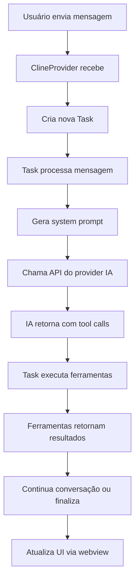
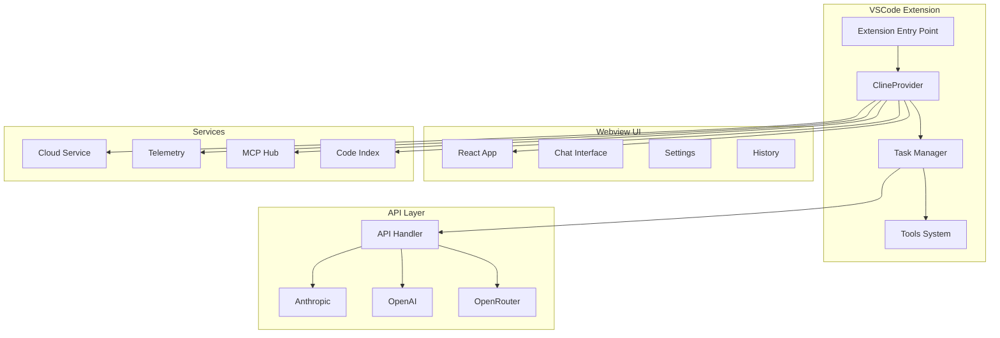
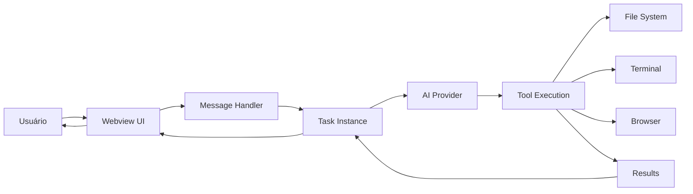
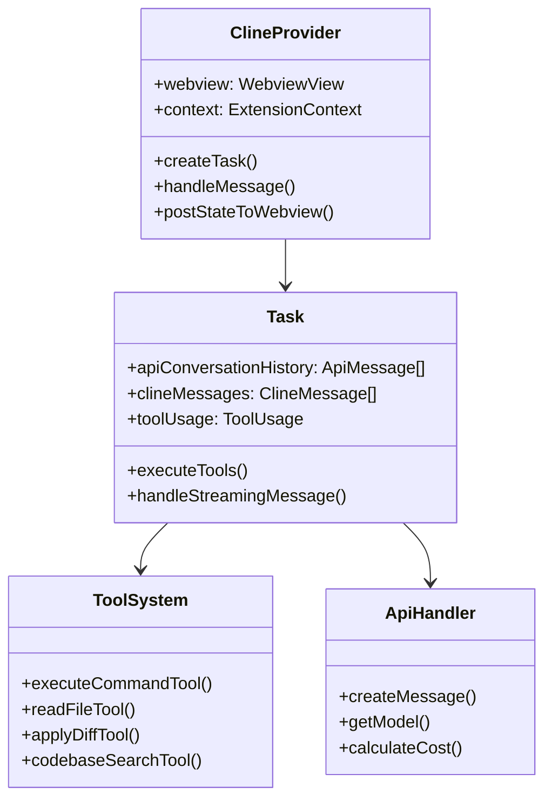
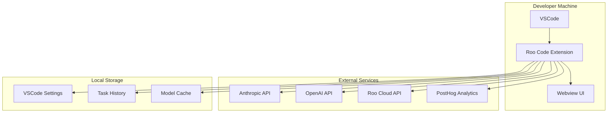

# Descoberta Técnica - Roo Code

**Data:** 2025-01-20  
**Projeto:** Roo Code (anteriormente Roo Cline)  
**Tipo:** Extensão VSCode - Agente de Codificação IA Autônomo  

---

## 1. Resumo do README/Arquivos de Instruções

### Visão Geral do Projeto
O **Roo Code** é um agente de codificação IA autônomo que vive dentro do editor VSCode. É uma ferramenta que permite aos desenvolvedores interagir com IA em linguagem natural para realizar tarefas complexas de desenvolvimento.

**Principais características segundo o [README.md](README.md):**
- Comunicação em linguagem natural
- Leitura e escrita de arquivos diretamente no workspace
- Execução de comandos de terminal
- Automação de browser actions
- Integração com qualquer API compatível com OpenAI ou modelos customizados
- Personalização através de "Custom Modes"

### Configuração e Execução Local
Conforme descrito no [README.md](README.md) e [CONTRIBUTING.md](CONTRIBUTING.md):

1. **Clonar o repositório:**
```bash
git clone https://github.com/RooCodeInc/Roo-Code.git
```

2. **Instalar dependências:**
```bash
pnpm install
```

3. **Executar a extensão:**
   - **Modo de desenvolvimento (F5):** Para desenvolvimento ativo, usar debug do VSCode
   - **Instalação automática VSIX:**
     ```bash
     pnpm install:vsix [-y] [--editor=<command>]
     ```
   - **Build manual do VSIX:**
     ```bash
     pnpm vsix
     code --install-extension bin/roo-cline-<version>.vsix
     ```

### Padrões e Diretrizes de Contribuição
- **Issue-First Approach:** Todas as contribuições devem começar com um GitHub Issue
- **Roadmap focus:** Reliability First, Enhanced UX, Leading on Agent Performance
- **Community:** Discord principal para comunicação, GitHub Projects para contribuidores experientes
- Uso de changesets para versionamento e publicação

---

## 2. Stack Tecnológica Detalhada

### Linguagens de Programação
- **TypeScript** - Linguagem principal ([tsconfig.json](tsconfig.json))
- **JavaScript** - Para alguns scripts e configurações
- **Node.js 20.19.2** - Runtime conforme [package.json](package.json)

### Frameworks e Bibliotecas Principais

#### Backend/Extensão
- **VSCode Extension API** - Base da extensão ([src/extension.ts](src/extension.ts))
- **Node.js** - Runtime do backend
- **Anthropic SDK** - Integração com Claude ([src/api/providers/anthropic.ts](src/api/providers/anthropic.ts))
- **OpenAI SDK** - Integração com GPT models

#### Frontend (Webview UI)
- **React 18.3.1** - Framework UI principal ([webview-ui/package.json](webview-ui/package.json))
- **Vite 6.3.5** - Build tool e dev server
- **TailwindCSS 4.0.0** - Framework CSS
- **Radix UI** - Componentes de UI
- **React Query** - State management para data fetching

#### Gerenciamento de Dependências e Build
- **pnpm 10.8.1** - Package manager ([package.json](package.json))
- **Turbo 2.5.3** - Monorepo build system ([turbo.json](turbo.json))
- **ESBuild 0.25.0** - Bundler para produção
- **TypeScript 5.4.5** - Compilador

### Provedores de IA Suportados
Conforme [src/api/providers/](src/api/providers/):
- **Anthropic** (Claude) - [anthropic.ts](src/api/providers/anthropic.ts)
- **OpenAI** (GPT) - [openai.ts](src/api/providers/openai.ts)
- **OpenRouter** - [router-provider.ts](src/api/providers/router-provider.ts)
- **AWS Bedrock** - [bedrock.ts](src/api/providers/bedrock.ts)
- **Google Vertex AI** - [anthropic-vertex.ts](src/api/providers/anthropic-vertex.ts)
- **Groq** - [groq.ts](src/api/providers/groq.ts)
- **Mistral** - [mistral.ts](src/api/providers/mistral.ts)
- **DeepSeek** - [deepseek.ts](src/api/providers/deepseek.ts)
- **LM Studio** - [lm-studio.ts](src/api/providers/lm-studio.ts)
- **Ollama** - Local models
- **LiteLLM** - Proxy para múltiplos providers
- **VSCode Language Models** - Modelos nativos do VSCode

### Arquitetura
- **Monorepo** - Estrutura modular com múltiplos packages
- **Event-Driven** - Uso extensivo de EventEmitter
- **Plugin Architecture** - Sistema extensível de tools e modes
- **Microservices-like** - Packages independentes (cloud, telemetry, types)

### Ferramentas de Desenvolvimento
- **ESLint 9.27.0** - Linting ([eslint.config.mjs](eslint.config.mjs))
- **Prettier 3.4.2** - Code formatting
- **Husky 9.1.7** - Git hooks
- **Vitest** - Testing framework
- **Changesets** - Release management

---

## 3. Visão Geral e Propósito

### O que o Sistema Faz
O Roo Code é um **agente de codificação IA autônomo** que funciona como um assistente de desenvolvimento integrado ao VSCode. Ele permite aos desenvolvedores:

1. **Automatizar tarefas de codificação** através de linguagem natural
2. **Refatorar e debugar código** existente
3. **Gerar código** a partir de descrições
4. **Responder perguntas** sobre o codebase
5. **Criar documentação** automaticamente
6. **Executar tarefas repetitivas** de forma autônoma

### Problemas que Resolve
- **Redução do tempo de desenvolvimento** através de automação
- **Melhoria da produtividade** com assistência IA contextual
- **Onboarding mais rápido** em projetos complexos
- **Consistência de código** através de patterns automatizados
- **Documentação atualizada** automaticamente

### Funcionalidades Centrais
Conforme [src/core/tools/](src/core/tools/):

1. **Manipulação de Arquivos**
   - Leitura: [readFileTool.ts](src/core/tools/readFileTool.ts)
   - Escrita: [writeToFileTool.ts](src/core/tools/writeToFileTool.ts)
   - Busca: [searchFilesTool.ts](src/core/tools/searchFilesTool.ts)
   - Aplicação de diffs: [applyDiffTool.ts](src/core/tools/applyDiffTool.ts)

2. **Execução de Comandos**
   - Terminal: [executeCommandTool.ts](src/core/tools/executeCommandTool.ts)
   - Browser automation: [browserActionTool.ts](src/core/tools/browserActionTool.ts)

3. **Busca e Análise de Código**
   - Busca semântica: [codebaseSearchTool.ts](src/core/tools/codebaseSearchTool.ts)
   - Listagem de arquivos: [listFilesTool.ts](src/core/tools/listFilesTool.ts)

4. **Gestão de Tarefas**
   - Completion: [attemptCompletionTool.ts](src/core/tools/attemptCompletionTool.ts)
   - Subtarefas: [newTaskTool.ts](src/core/tools/newTaskTool.ts)

### Domínios de Negócio
- **Desenvolvimento de Software** - Foco principal
- **DevOps** - Automação de pipelines e deployment
- **Documentação Técnica** - Geração automática
- **Code Review** - Análise e sugestões
- **Testing** - Geração de testes automáticos

---

## 4. Estrutura do Projeto e Recomendações de Leitura

### Ponto de Entrada Principal
O arquivo de entrada da extensão é [**src/extension.ts**](src/extension.ts). Este arquivo:
- Inicializa a extensão VSCode
- Configura serviços principais (telemetry, cloud, MDM)
- Registra comandos e providers
- Configura hot reload para desenvolvimento

### Organização Geral

#### Estrutura de Pastas Principais
```
my-roo-code/
├── src/                          # Código principal da extensão
│   ├── core/                     # Componentes centrais
│   │   ├── task/                 # Gerenciamento de tarefas
│   │   ├── tools/                # Ferramentas do agente
│   │   ├── prompts/              # Sistema de prompts
│   │   └── webview/              # Integração webview
│   ├── api/                      # Provedores de IA
│   ├── services/                 # Serviços auxiliares
│   └── shared/                   # Utilitários compartilhados
├── webview-ui/                   # Interface React
├── packages/                     # Packages do monorepo
│   ├── types/                    # Tipos TypeScript compartilhados
│   ├── cloud/                    # Serviços cloud
│   ├── telemetry/               # Analytics e telemetria
│   └── evals/                   # Sistema de avaliação
└── apps/                        # Aplicações auxiliares
    ├── vscode-e2e/              # Testes E2E
    ├── web-roo-code/            # Website
    └── web-evals/               # Interface de avaliações
```

### Arquivos de Configuração Principais
- [**package.json**](package.json) - Dependências e scripts principais
- [**turbo.json**](turbo.json) - Configuração do monorepo
- [**tsconfig.json**](tsconfig.json) - Configuração TypeScript
- [**eslint.config.mjs**](eslint.config.mjs) - Regras de linting

### Recomendação de Leitura (Ordem Sugerida)

1. **Início - Entendimento Geral**
   - [README.md](README.md) - Visão geral do projeto
   - [src/extension.ts](src/extension.ts) - Ponto de entrada
   - [package.json](package.json) - Dependências e scripts

2. **Core Architecture**
   - [src/core/webview/ClineProvider.ts](src/core/webview/ClineProvider.ts) - Provider principal
   - [src/core/task/Task.ts](src/core/task/Task.ts) - Classe central de tarefas
   - [packages/types/src/index.ts](packages/types/src/index.ts) - Tipos compartilhados

3. **Tools System**
   - [src/core/tools/](src/core/tools/) - Explorar ferramentas disponíveis
   - [src/shared/tools.ts](src/shared/tools.ts) - Configuração de tools

4. **UI Components**
   - [webview-ui/src/App.tsx](webview-ui/src/App.tsx) - App principal React
   - [webview-ui/src/components/](webview-ui/src/components/) - Componentes UI

5. **API Integration**
   - [src/api/](src/api/) - Provedores de IA
   - [src/core/prompts/system.ts](src/core/prompts/system.ts) - Sistema de prompts

---

## 5. Componentes Chave

### 5.1 ClineProvider
**Localização:** [src/core/webview/ClineProvider.ts](src/core/webview/ClineProvider.ts)

**Responsabilidade:** Classe central que gerencia a interface webview e coordena todas as interações entre UI e backend.

```typescript
export class ClineProvider
    extends EventEmitter<ClineProviderEvents>
    implements vscode.WebviewViewProvider, TelemetryPropertiesProvider
{
    public static readonly sideBarId = `${Package.name}.SidebarProvider`
    // Gerencia estado global, tasks, e comunicação webview
}
```

### 5.2 Task
**Localização:** [src/core/task/Task.ts](src/core/task/Task.ts)

**Responsabilidade:** Classe principal que representa uma tarefa de IA, gerenciando o lifecycle completo da interação.

```typescript
export class Task extends EventEmitter<ClineEvents> {
    // Propriedades principais
    apiConversationHistory: ApiMessage[] = []
    clineMessages: ClineMessage[] = []
    toolUsage: ToolUsage = {}
    
    // Controle de ferramentas e estado
    consecutiveMistakeCount: number = 0
    diffEnabled: boolean = false
    
    // Serviços integrados
    browserSession: BrowserSession
    diffViewProvider: DiffViewProvider
}
```

### 5.3 Sistema de Tools
**Localização:** [src/core/tools/](src/core/tools/)

**Responsabilidade:** Conjunto extensível de ferramentas que o agente IA pode usar.

**Principais ferramentas:**
- `executeCommandTool` - Execução de comandos terminal
- `readFileTool` - Leitura de arquivos
- `applyDiffTool` - Aplicação de mudanças
- `codebaseSearchTool` - Busca semântica no código
- `browserActionTool` - Automação de browser

### 5.4 Sistema de Modos
**Localização:** [src/shared/modes.ts](src/shared/modes.ts)

**Responsabilidade:** Gerencia diferentes personalities/modos do agente.

```typescript
export const modes: Mode[] = [
    {
        slug: "code",
        name: "Code",
        roleDefinition: "You are Roo Code, an AI assistant that helps with coding tasks.",
        // ... configurações específicas
    },
    // Architect, Ask, Debug modes, etc.
]
```

### 5.5 API Handler System
**Localização:** [src/api/](src/api/)

**Responsabilidade:** Abstração para diferentes provedores de IA.

```typescript
// Exemplo de provider
export class AnthropicHandler extends BaseProvider implements SingleCompletionHandler {
    async createMessage(systemPrompt: string, messages: ApiMessage[]): Promise<ApiStream> {
        // Implementação específica do Anthropic
    }
}
```

### 5.6 Webview UI (React)
**Localização:** [webview-ui/src/](webview-ui/src/)

**Responsabilidade:** Interface de usuário em React para interação com o agente.

**Componentes principais:**
- `ChatView` - Interface de chat principal
- `SettingsView` - Configurações
- `HistoryView` - Histórico de tarefas
- `ModesView` - Seleção de modos

---

## 6. Fluxos de Execução e Dados

### 6.1 Fluxo Principal de Interação do Usuário



### 6.2 Fluxo de Execução de Ferramentas

1. **Validação:** Verificação de parâmetros e permissões
2. **Aprovação:** Solicitação de aprovação do usuário (se necessário)
3. **Execução:** Execução da ferramenta específica
4. **Resultado:** Retorno do resultado para o IA
5. **Continuação:** IA usa resultado para próximas ações

### 6.3 Fluxo de Dados

**Persistência:**
- **Estado da extensão:** VSCode ExtensionContext
- **Histórico de tarefas:** Arquivo JSON local
- **Configurações:** VSCode Settings
- **Cache de modelos:** Sistema de cache em memória e arquivo

**Comunicação Webview ↔ Extension:**
```typescript
// Extension -> Webview
postMessage({ type: "state", state: currentState })

// Webview -> Extension  
vscode.postMessage({ type: "askResponse", askResponse: response })
```

### 6.4 Integração com Serviços Externos

**Cloud Services ([packages/cloud/](packages/cloud/)):**
- Autenticação de usuário
- Sincronização de configurações
- Analytics avançados

**Telemetry ([packages/telemetry/](packages/telemetry/)):**
- PostHog para analytics
- Coleta de métricas de uso
- Tracking de performance

---

## 7. Dependências e Integrações

### 7.1 Dependências Principais

**Core Dependencies ([package.json](package.json)):**
```json
{
  "@anthropic-ai/sdk": "^0.x.x",        // Integração Claude
  "@vscode/vsce": "3.3.2",              // VSCode Extension CLI
  "esbuild": "^0.25.0",                 // Bundler
  "turbo": "^2.5.3"                     // Monorepo management
}
```

**Webview UI ([webview-ui/package.json](webview-ui/package.json)):**
```json
{
  "react": "^18.3.1",                   // UI Framework
  "@radix-ui/*": "^1.x.x",             // UI Components
  "tailwindcss": "^4.0.0",             // CSS Framework
  "@tanstack/react-query": "^5.68.0"    // State management
}
```

### 7.2 Integrações Externas

#### Provedores de IA
- **Anthropic** - Claude models via REST API
- **OpenAI** - GPT models via oficial SDK
- **OpenRouter** - Proxy para múltiplos providers
- **AWS Bedrock** - Claude via AWS
- **Google Vertex AI** - Modelos Google

#### Browser Automation
- **Playwright** - Para browser actions ([src/services/browser/](src/services/browser/))

#### Model Context Protocol (MCP)
- **Servidores MCP** - Extensibilidade via protocolo padronizado
- **Localização:** [src/services/mcp/](src/services/mcp/)

#### Code Indexing
- **OpenAI Embeddings** - Para busca semântica
- **Qdrant** - Vector database para indexação
- **Localização:** [src/services/code-index/](src/services/code-index/)

### 7.3 Sistema de Marketplace
**Localização:** [src/services/marketplace/](src/services/marketplace/)

Permite instalação de:
- Custom modes
- Ferramentas MCP
- Templates de prompts

---

## 8. Diagramas

### 8.1 Diagrama de Componentes



### 8.2 Diagrama de Fluxo de Dados



### 8.3 Diagrama de Classes (Principais)



### 8.4 Diagrama de Implantação



---

## 9. Testes

### 9.1 Estratégia de Testes

O projeto utiliza múltiplas abordagens de teste:

#### Testes Unitários
- **Framework:** Vitest
- **Localização:** Arquivos `*.spec.ts` e `*.test.ts` distribuídos pelo código
- **Exemplos:**
  - [src/core/tools/__tests__/](src/core/tools/__tests__/)
  - [webview-ui/src/__tests__/](webview-ui/src/__tests__/)

#### Testes E2E
- **Framework:** VSCode Test + Mocha
- **Localização:** [apps/vscode-e2e/](apps/vscode-e2e/)
- **Configuração:** [apps/vscode-e2e/src/runTest.ts](apps/vscode-e2e/src/runTest.ts)

#### Testes de Integração
- **Sistema de Evals:** [packages/evals/](packages/evals/)
- **Docker-based:** Para ambiente isolado

### 9.2 Execução de Testes

#### Testes Unitários
```bash
# Todos os testes
pnpm test

# Testes específicos por package
cd src && npx vitest run path/to/test-file
cd webview-ui && npx vitest run src/path/to/test-file
```

#### Testes E2E
```bash
cd apps/vscode-e2e
npm run test:run

# Teste específico
TEST_FILE="apply-diff.test" npm run test:run
```

#### Sistema de Evals
```bash
# Com Docker
pnpm evals

# Localmente
cd packages/evals
npm run dev
```

### 9.3 CI/CD e Testes

**GitHub Actions ([.github/workflows/code-qa.yml](.github/workflows/code-qa.yml)):**
- Testes unitários em múltiplas plataformas (Ubuntu, Windows)
- Verificação de tipos TypeScript
- Linting
- Verificação de traduções

**Configuração de Qualidade:**
- **Knip:** Detecção de código não utilizado
- **ESLint:** Linting rigoroso
- **Prettier:** Formatação automática
- **Husky:** Git hooks para qualidade

---

## 10. Tratamento de Erros e Logging

### 10.1 Sistema de Logging

**Localização:** [src/utils/logging/](src/utils/logging/)

**CompactLogger ([src/utils/logging/CompactLogger.ts](src/utils/logging/CompactLogger.ts)):**
```typescript
export class CompactLogger implements ILogger {
    debug(message: string, meta?: LogMeta): void
    info(message: string, meta?: LogMeta): void  
    warn(message: string, meta?: LogMeta): void
    error(message: string | Error, meta?: LogMeta): void
    fatal(message: string | Error, meta?: LogMeta): void
}
```

**Características:**
- Logging estruturado com metadata
- Suporte a Error objects com stack traces
- Child loggers com contexto herdado
- Transport plugável

### 10.2 Tratamento de Erros

#### Estratégias por Camada

**Task Level:**
- `consecutiveMistakeCount` - Controle de erros consecutivos
- `handleError` - Handler centralizado de erros
- Recovery automático com retry logic

**Tool Level:**
- Validação de parâmetros obrigatórios
- Error boundaries para cada ferramenta
- Fallback graceful em caso de falha

**API Level:**
- Retry automático com backoff
- Circuit breaker pattern
- Error normalization entre providers

#### Monitoramento e Observabilidade

**Telemetria ([packages/telemetry/](packages/telemetry/)):**
- PostHog para tracking de erros
- Métricas de performance
- User journey analytics

**Output Channel:**
- VSCode output channel para debug
- Logs estruturados para troubleshooting

---

## 11. Considerações de Segurança

### 11.1 Mecanismos de Segurança

#### Autenticação e Autorização
- **API Keys:** Armazenamento seguro no VSCode settings
- **Cloud Authentication:** OAuth2 flow para Roo Cloud
- **Provider tokens:** Encrypted storage

#### Validação e Sanitização
- **Command execution:** Validation whitelist
- **File operations:** Path traversal protection
- **Input sanitization:** XSS prevention na UI

#### Proteção de Dados
- **RooIgnore System ([src/core/ignore/](src/core/ignore/)):** Proteção de arquivos sensíveis
- **RooProtect ([src/core/protect/](src/core/protect/)):** Proteção contra operações perigosas

### 11.2 Bibliotecas de Segurança

**Principais dependências de segurança:**
- **zod:** Validação de schema runtime
- **VSCode Security APIs:** Aproveitamento das security features nativas
- **Sanitização:** HTML e command sanitization

### 11.3 Práticas de Segurança

#### Princípios Implementados
- **Least Privilege:** Solicitação de aprovação para operações sensíveis
- **Input Validation:** Validação rigorosa de todos os inputs
- **Sandboxing:** Execução isolada de comandos quando possível
- **Audit Trail:** Logging de todas as operações

#### Proteção Contra Ataques Comuns
- **Command Injection:** Sanitização de comandos shell
- **Path Traversal:** Validação de paths de arquivo
- **XSS:** Sanitização na webview UI
- **Token Leakage:** Redaction em logs

---

## 12. Outras Observações Relevantes (Build/Deploy)

### 12.1 Sistema de Build

#### Configuração Turbo ([turbo.json](turbo.json))
```json
{
  "tasks": {
    "build": {
      "outputs": ["dist/**"],
      "inputs": ["src/**", "package.json", "tsconfig.json"]
    },
    "test": {
      "dependsOn": ["@roo-code/types#build"]
    }
  }
}
```

#### Scripts de Build Principais
```bash
# Build completo
pnpm build

# Bundle para produção
pnpm bundle

# Geração VSIX
pnpm vsix

# Build nightly
pnpm bundle:nightly && pnpm vsix:nightly
```

### 12.2 Deploy e Distribuição

#### GitHub Actions Workflows

**Marketplace Publishing ([.github/workflows/marketplace-publish.yml](.github/workflows/marketplace-publish.yml)):**
- Deploy automático para VSCode Marketplace
- Deploy para Open VSX Registry
- Triggered por tags de release

**Website Deploy ([.github/workflows/website-deploy.yml](.github/workflows/website-deploy.yml)):**
- Deploy automático para Vercel
- Build da aplicação web ([apps/web-roo-code/](apps/web-roo-code/))

**Nightly Builds ([.github/workflows/nightly-publish.yml](.github/workflows/nightly-publish.yml)):**
- Builds automáticos da versão de desenvolvimento

#### Release Management
- **Changesets:** Gestão automática de versioning
- **Semantic versioning:** Seguindo padrões semver
- **Release notes:** Geração automática via changesets

### 12.3 Configurações de Desenvolvimento

#### Hot Reload Development
```typescript
// Auto-reload durante desenvolvimento
if (process.env.NODE_ENV === "development") {
    // File watchers para reload automático
    const watchPaths = [
        { path: context.extensionPath, name: "extension" },
        { path: path.join(context.extensionPath, "../packages/types"), name: "types" }
    ]
}
```

#### Docker Support
- **Evals system:** Docker containers para isolated testing
- **Development:** Docker compose para serviços auxiliares

### 12.4 Observações Técnicas Importantes

#### Performance Considerations
- **Lazy Loading:** Componentes carregados sob demanda
- **Memoization:** Extensive use of React.memo e useMemo
- **Virtual Scrolling:** Para listas grandes na UI
- **Streaming:** Real-time AI responses

#### Internationalization
- **i18next:** Sistema completo de i18n
- **18 idiomas suportados:** Conforme [locales/](locales/)
- **Runtime language switching:** Troca dinâmica de idioma

#### Extensibility
- **MCP Protocol:** Extensibilidade via Model Context Protocol
- **Custom Modes:** Sistema de modos customizáveis
- **Plugin Architecture:** Tools extensíveis
- **Marketplace Integration:** Sistema de marketplace para extensions

#### Debugging e Development Tools
- **Source Maps:** Preservados para debugging
- **Development Mode:** Features específicas para desenvolvimento
- **API Mocking:** Suporte a providers de teste
- **Comprehensive Logging:** Sistema de logs estruturado

---

## Conclusão

O **Roo Code** é um projeto sofisticado e bem arquitetado que representa o estado da arte em agentes de codificação IA. A arquitetura modular, sistema extensível de ferramentas, e integração profunda com VSCode fazem dele uma solução robusta para automação de desenvolvimento.

**Pontos Fortes:**
- Arquitetura limpa e extensível
- Amplo suporte a provedores de IA
- Sistema robusto de ferramentas
- UI/UX bem polida
- Strong typing com TypeScript
- Sistema de testes abrangente
- CI/CD maduro

**Áreas de Complexidade:**
- Monorepo com múltiplas interdependências
- Sistema de prompts sofisticado
- Integração profunda com VSCode API
- Múltiplos pontos de configuração

Para novos desenvolvedores, recomendo começar explorando o [src/extension.ts](src/extension.ts) e seguir o fluxo através do [ClineProvider](src/core/webview/ClineProvider.ts) para entender o sistema de forma incremental. 